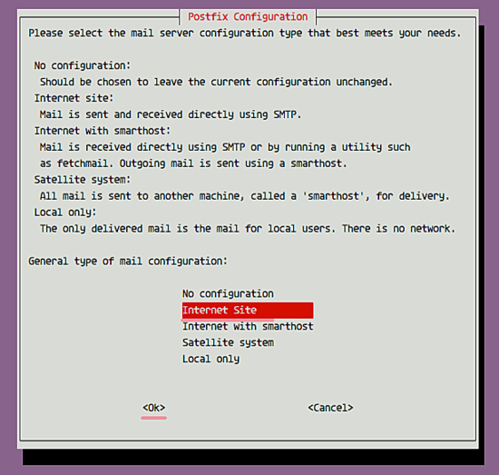
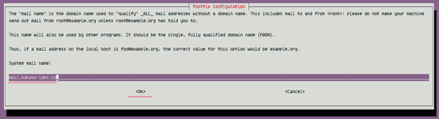
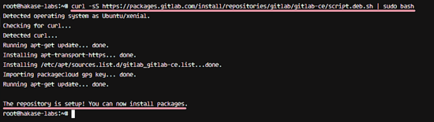
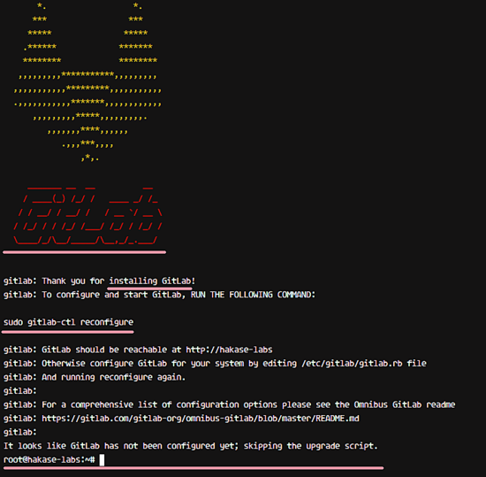
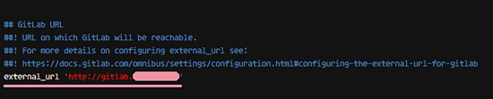
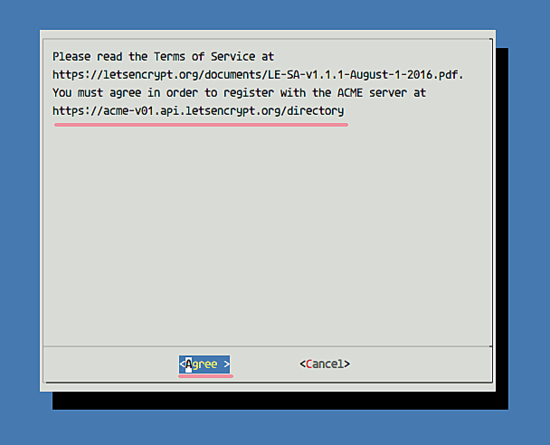
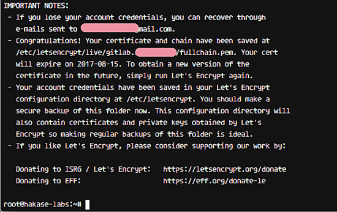
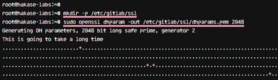
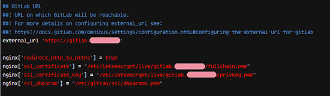

GitLab is available in four editions:

- Gitlab CE (Community Edition) - self-hosted, free and support from the Community forum.
- Gitlab EE (Enterprise Edition) - self-hosted, paid app, comes with additional features.
- GitLab.com - SaaS, free.
- GitLab.io - Private GitLab instance managed by GitLab Inc.


In this tutorial, I will show you step-by-step how to install GitLab CE (Community Edition) on your own Ubuntu 16.04 Xenial Xerus server. In this tutorial, I will be using the 'omnibus' package provided by GitLab for easy installation.


# What we will do:
- Install Packages
- Install GitLab
- Configure GitLab URL
- Generate SSL Let's encrypt and DHPARAM Certificate
- Enable Nginx HTTPS for GitLab
- Configure UFW Firewall
- Perform the GitLab Installation
- Testing

# Prerequisites

- Ubuntu 16.04 Server - 64bit
- Min RAM 2GB
- Root Privileges


# Step 1 - Install required Ubuntu Packages

The first step is to install the packages needed for the GitLab installation. Please log in to the server as root user and upddate the Ubuntu repository.

```bash 
ssh root@GitLabServer
apt-get update
```

Now install the packages including curl for downloading the GitLab repository, ca-certificates, and postfix for the SMTP configuration.

Install all packages with the apt command below.


`sudo apt install curl openssh-server ca-certificates postfix`


During postfix installation, you will be prompted about the configuration, select 'Internet Site'.



and then enter the server domain name that shall be used for sending an email.




# Step 2 - Install Gitlab

In this step, we will install GitLab using the omnibus packages. Omnibus will install all packages, services, and tools required for running GitLab on your server.

Add GitLab repository with the curl command.


`curl -sS https://packages.gitlab.com/install/repositories/gitlab/gitlab-ce/script.deb.sh | sudo bash`





And then install GitLab CE Community Edition with the apt command.

`sudo apt install gitlab-ce`


Wait for the server to download and install the gitlab package. When the installation is complete, you will see the results as below.




# Step 3 - Configure Gitlab Main URL

Now we should configure the URL that will be used to access our GitLab server. I will use the domain name 'gitlab.hakase-labs.co' for the GitLab URL here (please choose your own domain name) and I'll use HTTPS for users access security.

The main configuration of GitLab is in the '/etc/gitlab' directory. Go to that directory and edit the configuration file 'gitlab.rb' with vim.

`cd /etc/gitlab`

`vim gitlab.rb`


In the GitLab configuration go to line 9 'external_url' and change the URL to your URL 'gitlab.hakase-labs.co'.


`external_url 'http://gitlab.hakase-labs.co'`


Save the file and exit the editor. In the next step will enable HTTPS for GitLab.




# Step 4 - Generate SSL Let's encrypt and DHPARAM Certificate


In this step, we will enable the HTTPS protocol for GitLab. I will use a free SSL certificates provided by let's encrypt for the gitlab domain name.

Install letsencrypt command-line tool with apt command.

`sudo apt install letsencrypt -y`


When the installation is complete, generate a new certificate for the gitlab domain name with the command below.


`letsencrypt certonly -d gitlab.hakase-labs.co`

Enter your email address for the SSL certificate renew notification.


Choose 'Agree' for the Let's Encrypt Terms of Services and wait.




When it's done, you will see the result below.





New Let's encrypt certificate files for GitLab have been generated. You can find the certificate files in the '/etc/letsencrypt/live' directory.

Next, create a new directory named 'ssl' under the GitLab configuration directory.


`mkdir -p /etc/gitlab/ssl/`


And generate dhparam pem files in the ssl directory with the openssl command.


`sudo openssl dhparam -out /etc/gitlab/ssl/dhparams.pem 2048`





Now change the permissions of the certificate files to 600.

`chmod 600 /etc/gitlab/ssl/*`


The SSL Let's encrypt cert for GitLab and the DHPARAM certificate has been generated.

# Step 5 - Enable Nginx HTTPS for GitLab


At this stage, we have the certificate files from Letsencrypt in '/etc/letsencrypt/live' directory and the DHPARAM certificate in the '/etc/gitlab/ssl' directory.

In this step, we will configure a GitLab to use our certificate files. Go to the '/etc/gitlab' directory, then edit 'gitlab.rb' configuration with vim.

```bash 
cd /etc/gitlab/
vim gitlab.rb
```

Change the external url to use 'https' instead of 'http'.


`external_url 'https://gitlab.hakase-labs.co'`


Then add the new SSL configuration for gitlab as below.


```bash 

nginx['redirect_http_to_https'] = true
nginx['ssl_certificate'] = "/etc/letsencrypt/live/gitlab.hakase-labs.co/fullchain.pem"
nginx['ssl_certificate_key'] = "/etc/letsencrypt/live/gitlab.hakase-labs.co/privkey.pem"
nginx['ssl_dhparam'] = "/etc/gitlab/ssl/dhparams.pem"
```

**Note:**
<blockquote>
We will enable HTTP to HTTPS redirect in gitlab.gitlab-las.png

Save the file and exit vim.
</blockquote>





Now we need to run the command below as root to apply the new gitlab configuration.

`sudo gitlab-ctl reconfigure`


You will see the results as below.


HTTPS Configuration for GitLab has been completed.


# Step 6 - Configure UFW Firewall


In this step, we will enable the UFW firewall. It's already installed on the system, we just need to start the service. We will run GitLab behind the UFW firewall, so we must open the HTTP and HTTPS ports.

Enable UFW firewall with the command below.


`ufw enable`


The command will run ufw service and add it to start automatically at the boot time.

Next, open new ports ssh, HTTP, and HTTPS.


```bash 
	ufw allow ssh
	ufw allow http
	ufw allow https
```


Now check the firewall status and make sure ssh, http, and https ports is on the list.


`ufw status`


HTTP and HTTPS ports are configured.


[docs]: ../docs/7.5.0/index.md
